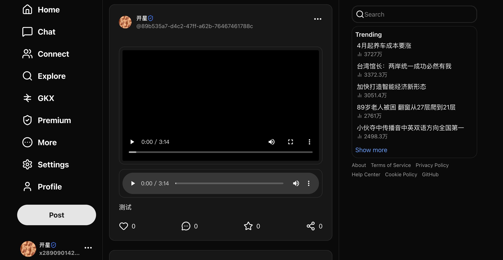
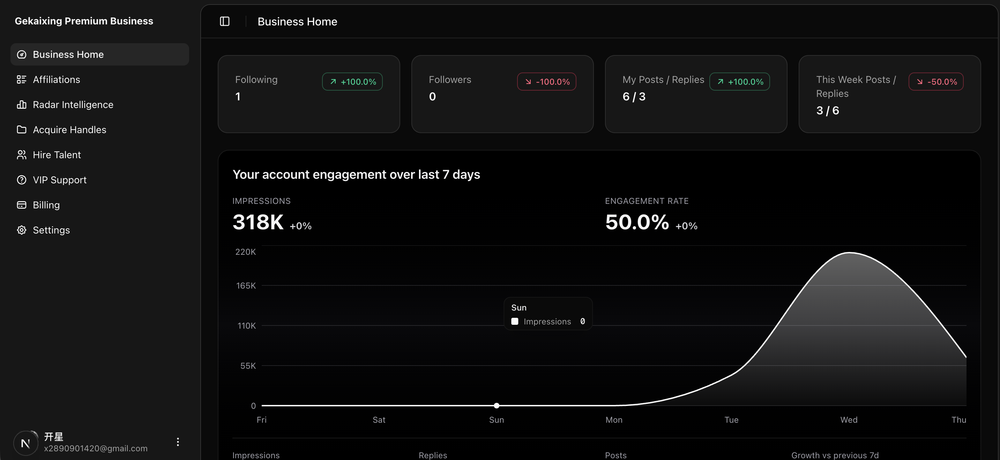
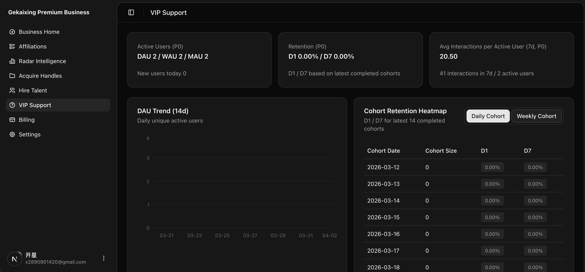
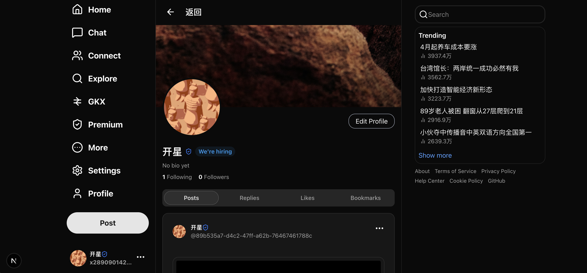
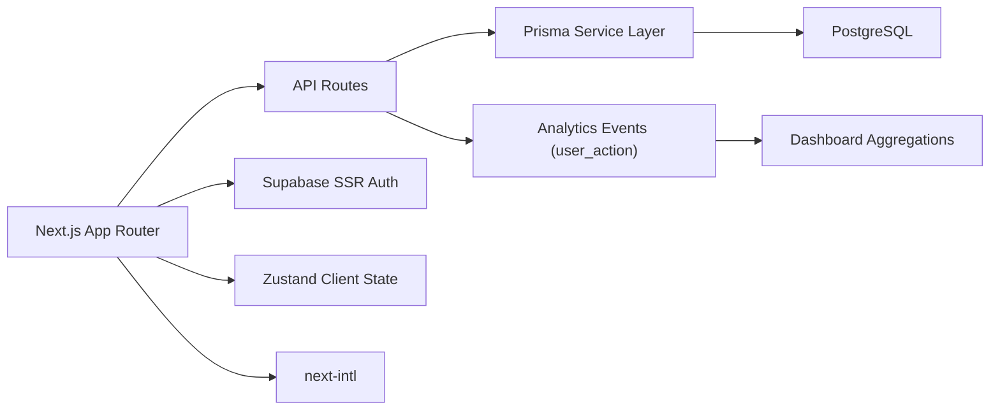

# Gekaixing / 个开心

[](https://nextjs.org/)
[](https://www.typescriptlang.org/)
[](https://www.prisma.io/)
[](./LICENSE)

A production-ready social platform template built with Next.js, Prisma, Supabase, and modern frontend tooling.  
一个可直接二次开发的社交平台模板，基于 Next.js、Prisma、Supabase 与现代前端技术栈。

## Table of Contents / 目录

- [Overview / 项目概览](#overview--项目概览)
- [Demo Screenshots / 页面截图](#demo-screenshots--页面截图)
- [Architecture / 架构图](#architecture--架构图)
- [Features / 功能列表](#features--功能列表)
- [Tech Stack / 技术栈](#tech-stack--技术栈)
- [Project Structure / 目录结构](#project-structure--目录结构)
- [Quick Start / 快速开始](#quick-start--快速开始)
- [Environment Variables / 环境变量](#environment-variables--环境变量)
- [Scripts / 常用命令](#scripts--常用命令)
- [Analytics & Dashboard / 数据看板](#analytics--dashboard--数据看板)
- [Roadmap / 路线图](#roadmap--路线图)
- [FAQ / 常见问题](#faq--常见问题)
- [Troubleshooting / 排障](#troubleshooting--排障)
- [Contributing / 贡献指南](#contributing--贡献指南)
- [Security / 安全](#security--安全)
- [License / 许可证](#license--许可证)

## Overview / 项目概览

- Social core: posts, replies, likes, bookmarks, shares, follow graph, messaging  
  社交核心：发帖、回复、点赞、收藏、转发、关注关系、私信
- AI hooks: AI chat and content-assist endpoints (Vercel AI SDK compatible)  
  AI 能力：AI 对话与内容辅助接口（兼容 Vercel AI SDK）
- i18n: Chinese and English (`next-intl`)  
  国际化：中英文双语（`next-intl`）
- Analytics dashboard: UV/PV, funnel segmentation, cohort retention, DAU/WAU/MAU  
  数据看板：UV/PV、漏斗分层、cohort 留存、DAU/WAU/MAU

## Demo Screenshots / 页面截图

### Feed / 信息流


### Dashboard Home / 业务首页


### VIP Support Analytics / 深度分析页


### Profile / 个人主页


Screenshots are stored in `docs/screenshots/`.  
截图统一放在 `docs/screenshots/` 目录。

## Architecture / 架构图



## Features / 功能列表

### Social / 社交
- Post creation / editing / deletion
- Reply threads
- Like / bookmark / share
- Follow / unfollow
- User profile and relationship graph
- Messaging entry and conversation views

### AI / AI
- Chat routes and streaming-ready integration points
- AI-assisted generation hooks for content workflows

### Dashboard / 看板
- Lightweight business home (`/dashboard`)
- Deep analytics module (`/dashboard/vip-support`)
- Cohort retention (daily/weekly)
- Traffic source / funnel / audience / content segmentation

## Tech Stack / 技术栈

- Framework: Next.js 16.1.6 (App Router)
- Language: TypeScript (strict mode)
- Styling: Tailwind CSS v4 + shadcn/ui
- Database: PostgreSQL + Prisma 7.x
- Auth/Storage: Supabase SSR
- State: Zustand
- Forms: React Hook Form + Zod
- i18n: next-intl

## Project Structure / 目录结构

```text
app/                 App Router pages and API routes
components/          UI and business components
lib/                 services and shared utilities
store/               Zustand stores
messages/            i18n dictionaries (zh-CN / en)
utils/               helper utilities
prisma/              schema and migrations
generated/           generated Prisma client
```

## Quick Start / 快速开始

```bash
# 1) Install dependencies
npm install

# 2) Configure env
cp .env.example .env.local

# 3) Generate Prisma client
npx prisma generate

# 4) Sync schema (dev)
npx prisma db push

# 5) Run dev server
npm run dev
```

Open [http://localhost:3000](http://localhost:3000).

## Environment Variables / 环境变量

Required (minimum) / 最低必需：

- `DATABASE_URL`
- `NEXT_PUBLIC_SUPABASE_URL`
- `NEXT_PUBLIC_SUPABASE_PUBLISHABLE_KEY`
- `NEXT_PUBLIC_SUPABASE_SERVICE_ROLE_KEY`

Optional / 可选：

- `NEXT_PUBLIC_URL` or `NEXT_PUBLIC_APP_URL`
- `GOOGLE_GENERATIVE_AI_API_KEY`
- `GLM_API_KEY`
- `NOTION_TOKEN`, `NOTION_DATABASE_ID`
- `STRIPE_SECRET_KEY`, `NEXT_PUBLIC_STRIPE_PUBLISHABLE_KEY`, `STRIPE_WEBHOOK_SECRET`

## Scripts / 常用命令

```bash
npm run dev            # start dev server
npm run build          # build for production
npm run start          # start production server
npm run lint           # run eslint
npx tsc --noEmit       # type-check only
```

Prisma:

```bash
npx prisma generate
npx prisma db push
npx prisma migrate dev
npx prisma studio
```

## Analytics & Dashboard / 数据看板

### Routes / 页面
- `/dashboard`: lightweight business overview（轻量总览）
- `/dashboard/vip-support`: deep analytics workspace（深度分析工作台）

### Current tracked signals / 当前埋点
- `FEED_IMPRESSION`
- `POST_CLICK`
- `PROFILE_ENTER` (stored as `POST_CLICK` + metadata)
- `REPLY_CREATE`
- `POST_LIKE`
- `POST_SHARE`
- `POST_BOOKMARK`
- `FOLLOW`

### Notes / 说明
- UV/PV switch supported in dashboard modules.
- Cohort view supports daily and weekly aggregation.

## Roadmap / 路线图

- [x] Core social interactions
- [x] Multilingual UI
- [x] Analytics dashboard (UV/PV + cohort + segmentation)
- [ ] Real-time notifications
- [ ] Full-text search and ranking improvements
- [ ] Recommender model experimentation workspace
- [ ] E2E testing suite

## FAQ / 常见问题

### 1) Why dashboard data looks stale?
- Ensure your env points to the expected database.
- Verify event writes in `user_action`.

### 2) Why retention is zero for some cohorts?
- Small cohort size or missing activity in the measured day can yield 0%.
- Weekly mode is usually more stable than daily mode.

### 3) How to add a new analytics metric?
- Add event logging in route/component.
- Extend aggregation in `lib/dashboard/service.ts`.
- Add types in `lib/dashboard/types.ts` and render in dashboard page.

## Troubleshooting / 排障

- Type errors:
  - Run `npx tsc --noEmit`
- Prisma/client mismatch:
  - Run `npx prisma generate`
- Schema mismatch:
  - Run `npx prisma db push` in development
- Auth issues:
  - Verify Supabase keys and callback URL configuration

## Contributing / 贡献指南

1. Create a feature branch.
2. Keep changes scoped and typed.
3. Run checks before PR:
   - `npm run lint`
   - `npx tsc --noEmit`
4. Include context, impact, and screenshots (for UI changes).

## Security / 安全

- Never commit secrets (`.env.local`, API keys).
- Rotate leaked keys immediately.
- For vulnerabilities, contact maintainers privately first.

## License / 许可证

MIT. See [LICENSE](./LICENSE).
