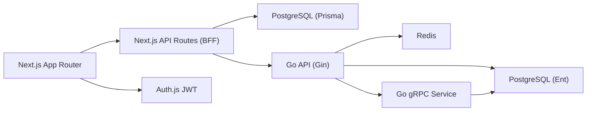

# Gekaixing / 个开心

[](https://nextjs.org/)
[](https://go.dev/)
[](https://www.typescriptlang.org/)
[](./LICENSE)

A hybrid social platform stack with Next.js + Go services.
基于 Next.js + Go 服务的混合架构社交平台。

中文部署手册：`docs/DEPLOY.zh-CN.md`

## Overview / 项目概览

- Social features: posts, replies, likes, bookmarks, shares, follow graph, messaging
- Auth: Auth.js + JWT (`user.id` is the canonical identity)
- Data: local PostgreSQL
- Cache: Redis
- Backend services: Gin HTTP API + gRPC service + Ent ORM
- AI hooks: Gemini/OpenAI integration points

## Architecture / 架构



## Tech Stack / 技术栈

- Web: Next.js 16.1.6, TypeScript, Tailwind CSS v4, shadcn/ui
- Auth: Auth.js (JWT strategy)
- ORM:
  - Next.js side: Prisma
  - Go side: Ent
- Backend: Gin, gRPC, go-redis, Zap, Viper
- Infra: Docker, Kubernetes

## Repository Structure / 目录结构

```text
app/                    Next.js pages and API routes
components/             UI and feature components
lib/                    shared libs (auth, prisma, helpers)
prisma/                 Prisma schema and migrations
utils/                  compatibility and utility helpers
backend-go/             Go services (Gin, Ent, gRPC)
deploy/docker/          Dockerfiles and docker-compose
deploy/k8s/base/        Kubernetes base manifests
```

## Quick Start (Local) / 本地快速开始

### 1) Install dependencies

```bash
npm install
```

### 2) Configure environment

```bash
cp .env.example .env.local
cp backend-go/.env.example backend-go/.env
```

### 3) Start PostgreSQL and Redis

Use local services, or run via Docker compose (see below).

### 4) Initialize frontend DB

```bash
npx prisma generate
npx prisma migrate dev
npm run init:storage
```

### 5) Run services

Terminal 1:
```bash
npm run dev
```

Terminal 2:
```bash
cd backend-go && go run ./cmd/api
```

Terminal 3:
```bash
cd backend-go && go run ./cmd/grpc
```

Open [http://localhost:3000](http://localhost:3000).

## Docker / 容器运行

```bash
cd deploy/docker
docker compose up --build
```

Docker files:
- `deploy/docker/frontend.Dockerfile`
- `deploy/docker/backend.api.Dockerfile`
- `deploy/docker/backend.grpc.Dockerfile`
- `deploy/docker/docker-compose.yml`

## Kubernetes / K8s

Base manifests are under `deploy/k8s/base`.

```bash
kubectl apply -k deploy/k8s/base
```

Important files:
- `namespace.yaml`
- `configmap.yaml`
- `secret.example.yaml` (copy and customize before apply)
- frontend/api/grpc deployments and services
- postgres statefulset + service
- redis deployment + service
- ingress and HPA

## Environment Variables / 环境变量

### Root (`.env.local`)

Required:
- `DATABASE_URL`
- `DIRECT_URL`
- `AUTH_SECRET`
- `NEXTAUTH_SECRET`
- `NEXTAUTH_URL`
- `NEXT_PUBLIC_URL`
- `GO_API_BASE_URL`

Optional:
- `NEXT_PUBLIC_APP_URL`
- `NEXT_PUBLIC_NEWs_key`
- `NOTION_TOKEN`
- `NOTION_DATABASE_ID`
- `STRIPE_SECRET_KEY`
- `NEXT_PUBLIC_STRIPE_PUBLISHABLE_KEY`
- `STRIPE_WEBHOOK_SECRET`

### Go (`backend-go/.env`)

Required:
- `HTTP_ADDR`
- `GRPC_ADDR`
- `AUTH_SECRET`
- `DATABASE_URL`
- `REDIS_ADDR`

Optional:
- `REDIS_PASSWORD`
- `REDIS_DB`
- `LOG_LEVEL`
- `GOPROXY`

If dependency download is blocked in mainland China, use:
- npm mirror: configure registry to domestic mirror
- Go proxy: `GOPROXY=https://goproxy.cn,direct`

## Scripts / 常用命令

```bash
# Frontend
npm run dev
npm run build
npm run start
npm run lint
npx tsc --noEmit
npm run test

# Prisma
npx prisma generate
npx prisma migrate dev
npx prisma db push

# Storage init
npm run init:storage

# Go tests
cd backend-go && go test ./...
```

## Testing / 测试

Minimum checks before merge:

```bash
npx tsc --noEmit
npm run test
cd backend-go && go test ./...
```

## Auth Contract / 认证约定

- JWT uses `user.id` as `sub`.
- All protected APIs must resolve current session and authorize by `user.id`.
- Do not use email as primary business identity.

## Notes / 说明

- This branch has migrated away from Supabase auth/storage/query runtime paths.
- Local storage uploads are served from `/uploads/<bucket>/<path>`.

## License / 许可证

MIT. See [LICENSE](./LICENSE).
